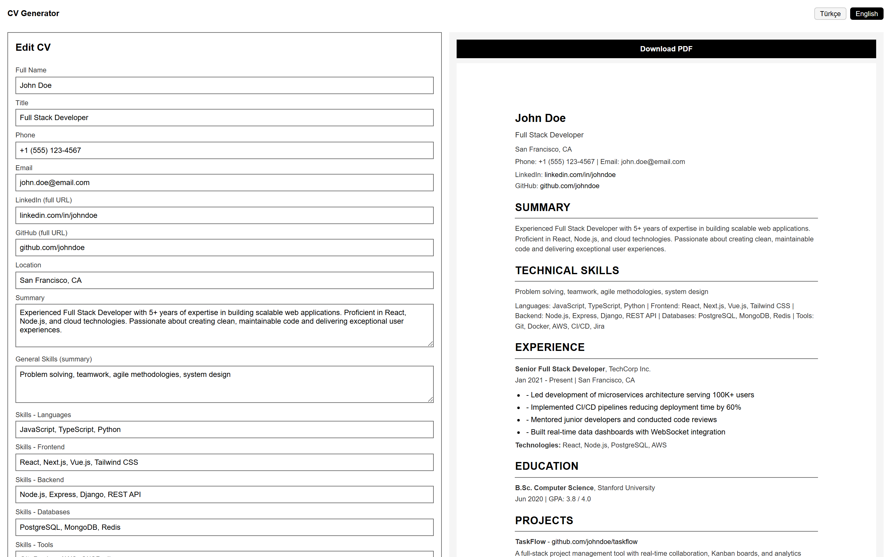
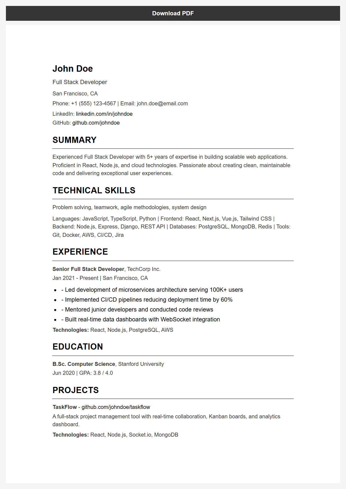
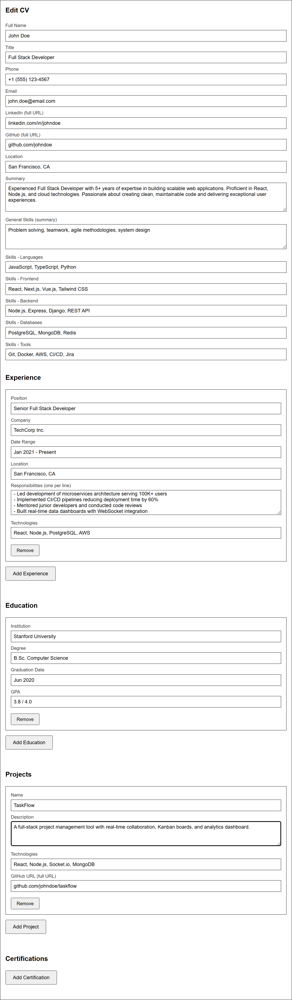
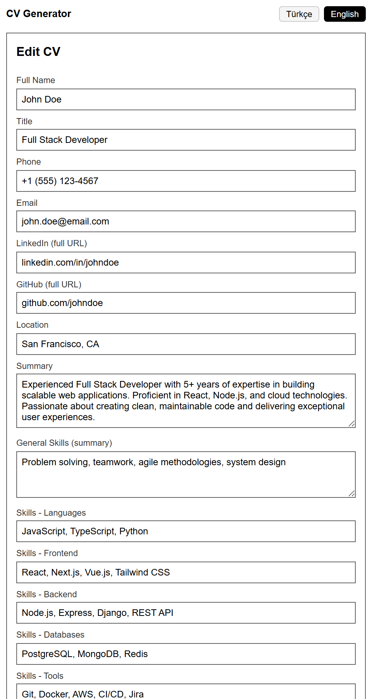

# 📄 CV Generator

A modern, ATS-friendly CV/resume builder built with **React** and **TypeScript**. Features a live preview, bilingual TR/EN interface, structured sections, and one-click PDF export.


🔗 **Live demo:** No default URL — after you deploy (e.g. [Vercel](https://vercel.com)), replace this line with your own production link if you want it in the README.

---

## 🚀 Features

- 📝 **Live Preview** — see your CV update in real-time as you type
- 🌐 **Bilingual Interface** — full Turkish and English support with dynamic language switching
- 📄 **PDF Export** — one-click download with ATS-optimized filename (e.g. `john_doe.pdf`)
- 📱 **Responsive Design** — works seamlessly on desktop, tablet, and mobile
- 🎯 **ATS-Friendly Layout** — clean, single-column CV format optimized for applicant tracking systems
- 🧩 **Modular Sections** — personal info, summary, skills, experience, education, projects, certifications
- ➕ **Dynamic Entries** — add or remove experience, education, project, and certification entries on the fly
- 🔤 **Smart Filename** — auto-generates PDF filename from your name with Turkish character normalization

---

## 🖼️ Screenshots

### Full Overview — Edit Form & Live Preview



### CV Preview



### Edit Form



### Mobile View



---

## 📦 Installation

```bash
git clone https://github.com/efedag/cv-generator.git
cd cv-generator
npm install
```

---

## ▶️ Usage

```bash
npm run dev
```

Open [http://localhost:5173](http://localhost:5173) in your browser.

---

## 🧩 Architecture Overview

```
cv-generator/
├── index.html                     # Entry HTML
├── package.json                   # Dependencies & scripts
├── vite.config.ts                 # Vite configuration
├── vercel.json                    # Vercel deployment config
│
├── public/                        # 🌐 Static Assets
│   ├── favicon.svg                # App favicon
│   └── icons.svg                  # UI icons
│
├── src/                           # 📂 Source Code
│   ├── main.tsx                   # React entry point
│   ├── App.tsx                    # Root layout & language toggle
│   ├── index.css                  # Global styles & responsive layout
│   │
│   ├── components/                # 🧱 UI Components
│   │   ├── EditForm.tsx           # Full editing form (all sections)
│   │   ├── CVPreview.tsx          # Preview wrapper & PDF trigger
│   │   ├── PersonalInfo.tsx       # Name, title, contact, links
│   │   ├── Summary.tsx            # Professional summary
│   │   ├── Skills.tsx             # Technical skills (categorized)
│   │   ├── Experience.tsx         # Work experience entries
│   │   ├── Education.tsx          # Education entries
│   │   ├── Projects.tsx           # Project entries
│   │   └── Certifications.tsx     # Certification entries
│   │
│   ├── data/                      # 📋 Default Data
│   │   ├── defaultCV.ts           # Empty CV template
│   │   └── templates.ts           # Starter templates (blank / samples)
│   │
│   ├── hooks/                     # 🪝 Custom Hooks
│   │   └── useCvAppState.ts       # Profiles, theme, margins, persistence
│   │
│   ├── storage/                   # 💾 Persistence
│   │   └── cvAppStorage.ts        # Versioned localStorage read/write
│   │
│   ├── types/                     # 📐 TypeScript Types
│   │   ├── cv.types.ts            # CV data model interfaces
│   │   └── appState.types.ts      # App UI + profile list types
│   │
│   └── utils/                     # ⚙️ Utilities
│       ├── pdfGenerator.ts        # html2pdf.js wrapper
│       ├── exportDocx.ts          # Word export (docx)
│       ├── exportMarkdown.ts      # Markdown export
│       ├── cvJsonFile.ts          # JSON import/export helpers
│       └── cvValidation.ts        # Soft validation + hints
│
└── screenshots/                   # 🖼️ README screenshots
```

---

## ⚙️ How It Works

### Two-Column Layout

The app uses a CSS Grid layout with two equal columns. The **left panel** contains the full editing form, and the **right panel** shows a live-rendered CV preview that updates instantly as you type.

### CV Sections

| Section              | Description                                                       |
| -------------------- | ----------------------------------------------------------------- |
| **Personal Info**    | Full name, title, phone, email, LinkedIn, GitHub, location        |
| **Summary**          | Free-text professional summary (2–4 sentences)                    |
| **Technical Skills** | Categorized: Languages, Frontend, Backend, Databases, Tools       |
| **Experience**       | Position, company, date range, location, responsibilities, tech   |
| **Education**        | Institution, degree, graduation date, GPA                        |
| **Projects**         | Name, description, technologies, GitHub URL                       |
| **Certifications**   | Certificate name, issuer, date                                    |

### PDF Generation

Uses **html2pdf.js** (html2canvas + jsPDF) to capture the `#cv-content` DOM node and export it as an A4 PDF. The filename is auto-generated from the user's name with special character normalization (e.g. `Ömer Çelik` → `omer_celik.pdf`).

### Language System

All UI labels, placeholders, section titles, and button texts are dynamically switched between **Turkish** and **English** via a simple language toggle in the header.

---

## 🛠️ Tech Stack

| Component        | Technology                           |
| ---------------- | ------------------------------------ |
| **Framework**    | React 19                             |
| **Language**     | TypeScript 5.9                       |
| **Build Tool**   | Vite 8                               |
| **PDF Engine**   | html2pdf.js (html2canvas + jsPDF)    |
| **Styling**      | CSS (Grid layout, responsive)        |
| **Linting**      | ESLint 9 + typescript-eslint         |
| **Deployment**   | Vercel                               |

---

## 👨‍💻 Developer

**Efe Dag**

---

## 📌 Notes

- Clean, minimal CV design optimized for ATS parsing
- No external CSS frameworks — lightweight, hand-written styles
- Fully client-side — no backend or database required
- Responsive layout adapts from desktop two-column to mobile single-column

---

## 📄 License

This project is licensed under the **MIT License** — feel free to use, modify, and distribute.

---

⭐ **If you like the project, feel free to star the repository!**
